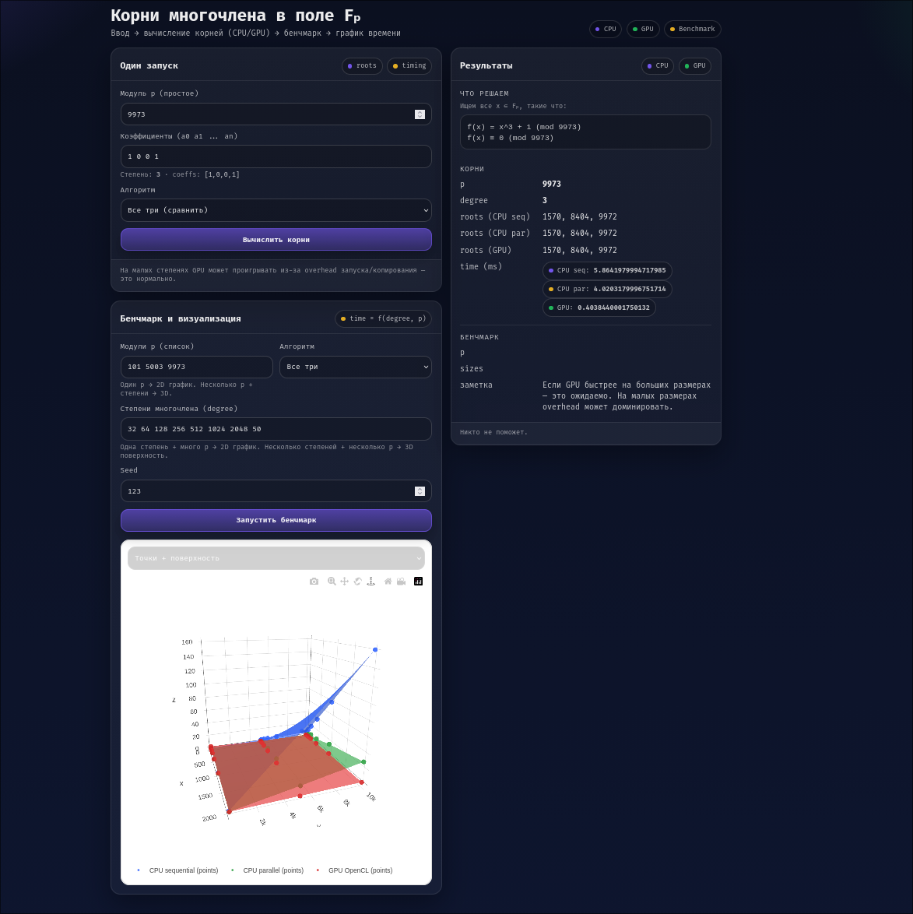

# Вычисление корней многочлена над конечным полем Fₚ
## CPU / CPU-parallel / GPU (OpenCL) + интерактивная визуализация

Проект посвящён вычислению корней заданного многочлена над конечным полем **Fₚ** и анализу производительности различных алгоритмов:
- последовательного (CPU),
- параллельного на CPU (Numba),
- параллельного на GPU (OpenCL).

Реализованы:
- backend на **Python (FastAPI)**,
- frontend на **React + TypeScript**,
- интерактивные **2D и 3D графики** времени выполнения.



## 🚀 Запуск проекта

### 1️⃣ Backend (Python)

#### Требования
- Python ≥ 3.13.9
- (опционально) OpenCL + GPU для ускорения

#### Установка зависимостей
```bash
cd backend
python -m venv .venv
source .venv/bin/activate
pip install -r requirements.txt
````

#### Запуск

```bash
uvicorn main:app --host 0.0.0.0 --port 8000
```

Если не может обнаружить видеокарту, можно попробовать явно указать пусть к драйверам:

```
OCL_ICD_VENDORS=/run/opengl-driver/etc/OpenCL/vendors uvicorn main:app --host 0.0.0.0 --port 8000
```

---

### 2️⃣ Frontend (Node.js)

#### Требования

* Node.js ≥ 18
* npm или yarn

#### Установка зависимостей

```bash
cd frontend
npm install
```

#### Запуск dev-сервера

```bash
npm run dev
```

Frontend будет доступен по адресу:

```
http://localhost:5173
```

